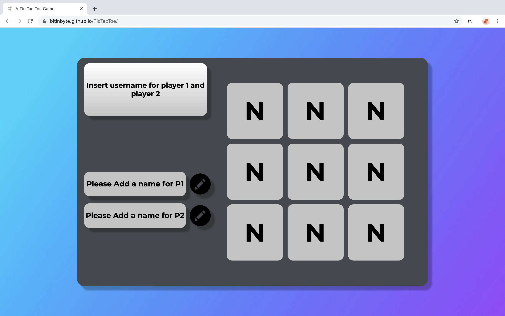

# TicTacToe Game
## [Check it here](https://bitinbyte.github.io/TicTacToe/)

Game created with ES5 Vanilla JavaScript HTML and CSS
## Getting Started
Just clone the git or check it live on the link above. Feel free to use it and to let me know what could be improved!
## Specifications
Website build in study case. The JavaScript version is the ES5 because I'm starting now and I want to learn the old methods first and then progress to the new methods. The website is responsive, feel free to try it in you tablet or in you phone and let me know if any version that you have tested is not compatible with the responsive.
## Built With
- HTML
- CSS3
- Vanilla JavaScript ES5
## Contributing
Feel free to download it and improve it. If you want just give a pull request with your changes and let me know what can be improved. Many thanks :D
## Pages
- [GitHub Page](https://github.com/BitInByte)
- [Instagram](https://www.instagram.com/bitinbyte/)
- [Twitter](https://twitter.com/BitInByte2)
## Authors
**BitInByte** - Development student and tech enthusiastic

